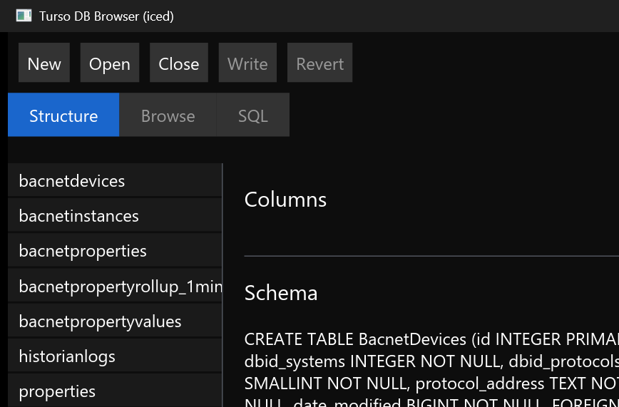
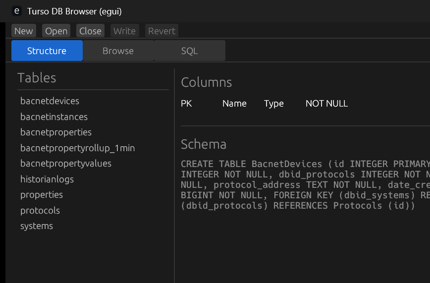
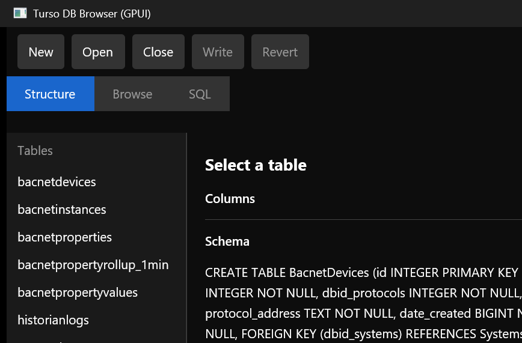
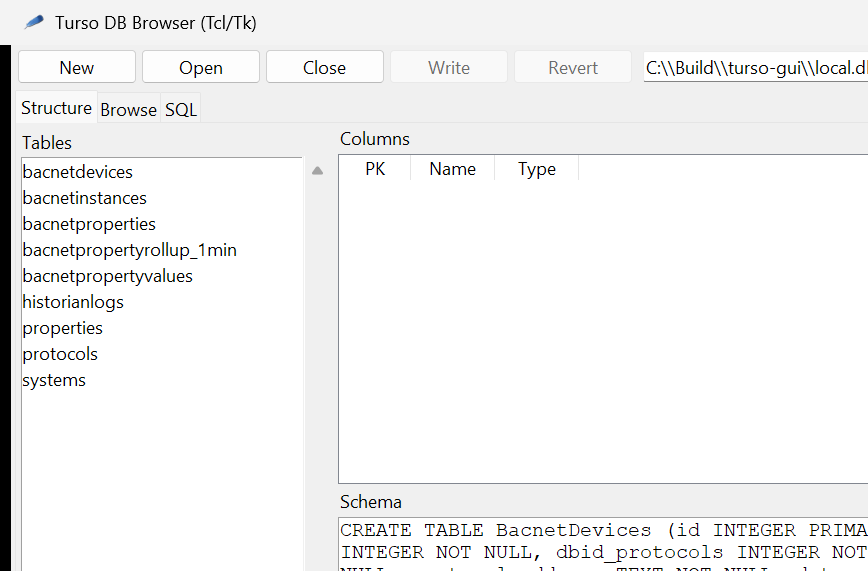
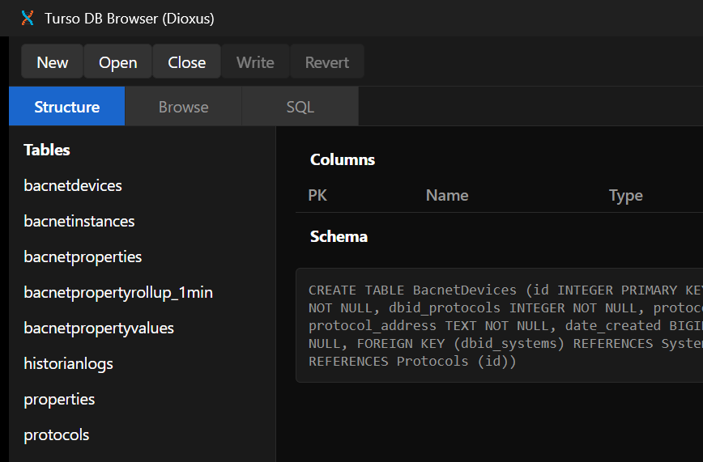
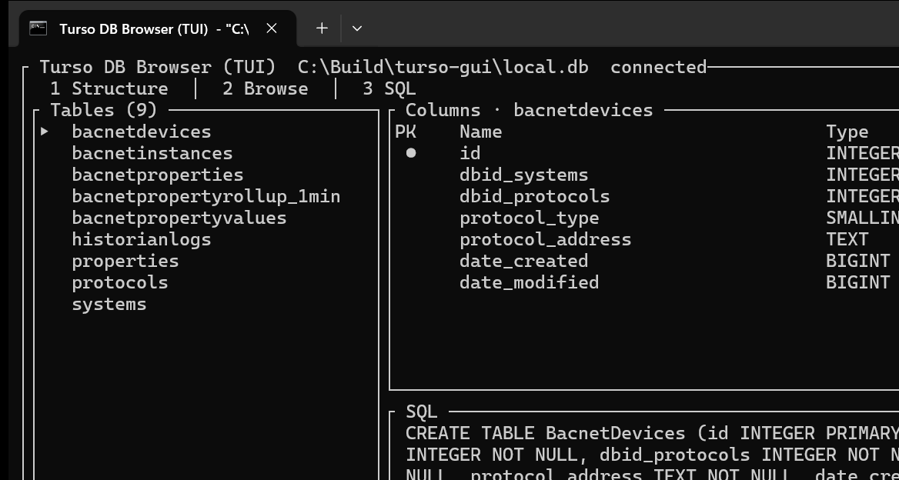

# Turso GUI

A SQLite / [Turso](https://turso.tech/) database browser with several front ends on one shared Rust core (`turso-gui-core`). The feature set is modeled on [DB Browser for SQLite](https://sqlitebrowser.org/): connect, inspect structure, browse rows, run SQL, and commit or revert writes.

All GUIs talk to the same `AppModel` (open/close, Structure / Browse / SQL, filters, sort, pagination, cell editor, write/revert).

## Screenshots

Captured from a connected `local.db` on the Structure tab.

### Iced

Default desktop binary (`turso-gui`).



### egui



### GPUI



### Tcl/Tk



### Dioxus



### TUI (Ratatui)



To recapture these images after UI changes:

```powershell
cargo build --workspace
powershell -ExecutionPolicy Bypass -File tools\capture-screenshots.ps1
```

## Front ends

| Front end | Package | Binary | Run |
| --- | --- | --- | --- |
| Iced | `turso-gui` | `turso-gui` | `cargo run -p turso-gui -- -d local.db` |
| egui | `turso-gui-egui` | `turso-gui-egui` | `cargo run -p turso-gui-egui -- -d local.db` |
| GPUI | `turso-gui-gpui` | `turso-gui-gpui` | `cargo run -p turso-gui-gpui -- -d local.db` |
| Tcl/Tk | `turso-gui-tk` | `turso-gui-tk` | `cargo run -p turso-gui-tk -- -d local.db` |
| Dioxus | `turso-gui-dioxus` | `turso-gui-dioxus` | `cargo run -p turso-gui-dioxus -- -d local.db` |
| TUI | `turso-gui-tui` | `turso-gui-tui` | `cargo run -p turso-gui-tui -- -d local.db` |

The default workspace member is Iced (`cargo run` builds `turso-gui`).

Tk needs a Tcl/Tk `wish` on `PATH` (for example `%LOCALAPPDATA%\Apps\Tcl86\bin\wish.exe`).

## Shared flags

Every binary accepts:

| Flag | Meaning |
| --- | --- |
| `-d`, `--database` | Database file path |
| `-t`, `--token` | Auth token (reserved for remote URLs) |
| `-D`, `--debug` | Debug logging |
| `--help` / `--version` | Clap help and version |

GUI binaries (not the TUI) also accept `--console` to open a log console. If you already started the app from a terminal, that terminal is reused and no extra window is created.

Iced additionally supports `--cli` and `-c` / `--command` for a non-GUI SQL shell.

On Windows, GUI apps do not spawn a console unless `--console` is set. New windows are sized to fit the work area (screen minus taskbar) and centered on screen.

## Tests

Cross-front-end checks (features, CLI flags, debug binary size, shared-model performance) live in `crates/eval`:

```powershell
cargo test -p turso-gui-eval -- --nocapture
```

Skip linking every GUI binary:

```powershell
$env:TURSO_GUI_SKIP_BINARIES = "1"
cargo test -p turso-gui-eval
```
